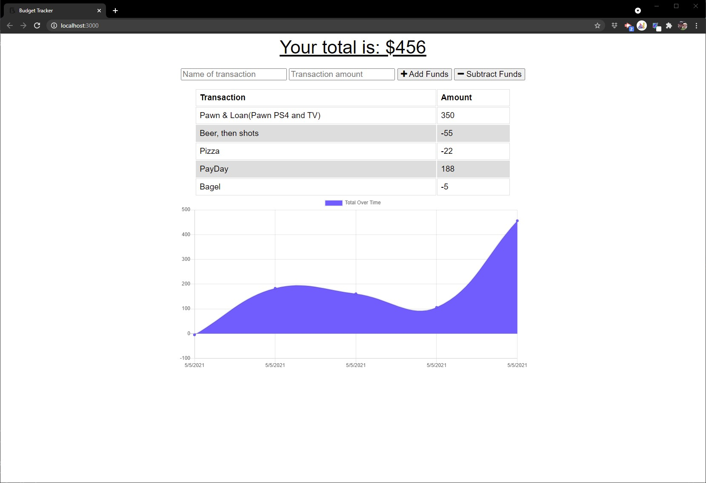

# Offline Budget Tracker

  []

  As an avid traveler, I want to be able to keep track of all of my spending and my income. 

  ## Table of Contents
  * [Installation](#Installation)
  * [Usage](#Usage)
  * [License](#License)
  * [Contributing](#Contributing)
  * [Tests](#Tests)
  * [Questions](#Questions)

## Installation

Please follow these steps to ensure a proper installation. 
Currently this app is running on Heroku, if you want to run it locally, please for the repo, and run "npm install" then "node server.js"

## Usage

The following will outline the steps needed to use this project.  
Simply add a descriptive name and  amount of money you paid or earned, and select either the "+ Add Funds" or "-Subtract Funds" button.  

## License
The MIT License

Please follow the link to learn more about the License this project is protected under. 
[https://opensource.org/licenses/MIT](https://opensource.org/licenses/MIT)

## Contributing

How can you contribute? 
Provide Feedback on anything that could allow this to function better. 

## Tests

The following test steps can be taken to ensure the project is running correctly. 
Add and Remove money by logging income and spending

## Questions

Please contact me with any questions about this project. 

My Heroku App can be found at [https://safe-gorge-16861.herokuapp.com/](https://safe-gorge-16861.herokuapp.com/)

My GitHub URL is [https://github.com/jmalm79](https://github.com/jmalm79)

Email: jmalm79@gmail.com

